  

  

  
  
  
  

---

## 🚀 About Me

I am a passionate **Computer Science & Engineering undergraduate** specializing in building highly performant, scalable, and visually stunning web applications. With a strong foundation in **System Architecture** and **Full-Stack Development**, I thrive on turning complex problems into elegant code.

* **📍 Location:** Dhaka, Bangladesh
* **🎓 Education:** CSE Undergrad
* **💡 Core Focus:** React Ecosystem, Robust Node.js Architectures, & Cloud Deployments
* **🌱 Currently Learning:** Advanced System Design, Microservices, and Kubernetes
* **🤝 Collaboration:** Open to interesting Open Source projects and full-stack opportunities

---

## 🛠️ Tech Stack & Ecosystem

### 💻 Frontend Development

  

### ⚙️ Backend & Databases

  

### ☁️ DevOps & Tools

  

### 🎯 Domains of Expertise

  
  
  
  

---

## 🛠️ Featured Projects & Portfolio

| Project / Platform | Description | Tech Stack | Live Deployment |
| :--- | :--- | :--- | :--- |
| **💼 Personal Portfolio** | My professional developer site featuring experience, skill frameworks, and web showcases. | `Next.js` `Tailwind CSS` `Vercel` | [Visit Live Site 🚀](https://hanjala-habib-sadik.vercel.app) |
| **🏏 CricketHub BD** | A comprehensive dynamic web application tracking services, matches, and database features for cricket operations. | `React` `Node.js` `MongoDB` | [Visit Live Site 🚀](https://crickethub-bd.vercel.app) |
| **🍽️ Messpro** | A smart university hostel/mess meal management web system streamlining daily calculations, dining records, and tracking. | `React` `Tailwind` `Firebase` | [Visit Live Site 🚀](https://meal-management-3a66d.web.app/) |

---

## 📊 GitHub Analytics

  

 

  

---

  Built with 💻 and ☕ by Hanjala. 

